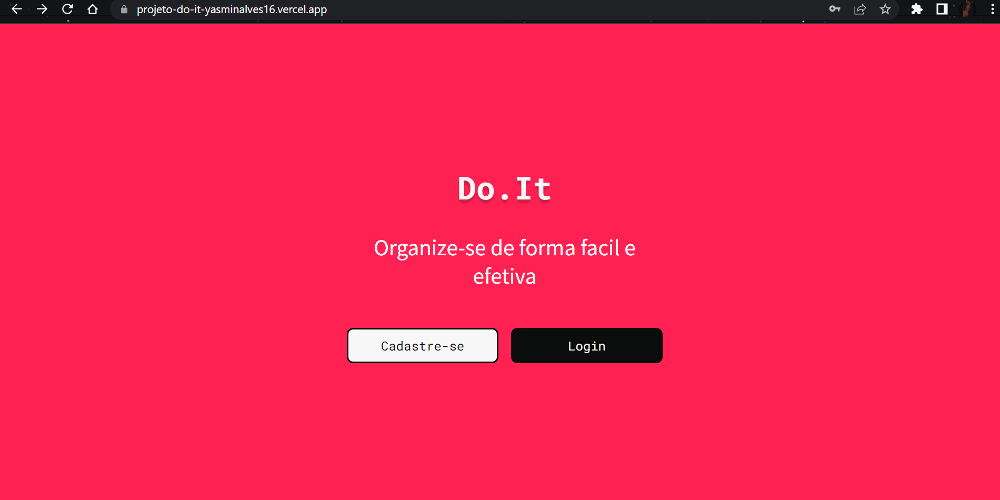

<h1>Do.It</h1>

## Descrição do projeto

O Do.It foi um projeto desenvolvido na Kenzie Academy com suporte do facilitador Gabriel. O Do.it é uma aplicação que auxilia os usuários no dia a dia, através do gerenciamento de Tasks. Nele é possivel fazer cadastro, login adicionar e excluir tasks. O projeto possui responsividade e mobileFirst

## Principais Técnologias Usadas

- ReactJs
- JavaScript
- CSS 
- HTML

- React-toastify
- Styled-components
- Yup (verficação de formularios)

## Como Acessar o Projeto: 
https://projeto-do-it-yasminalves16.vercel.app
